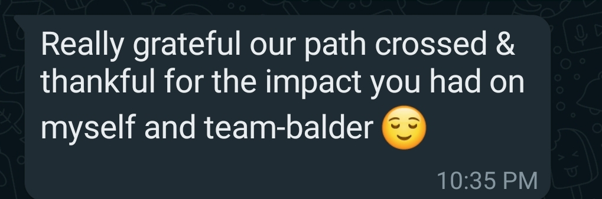
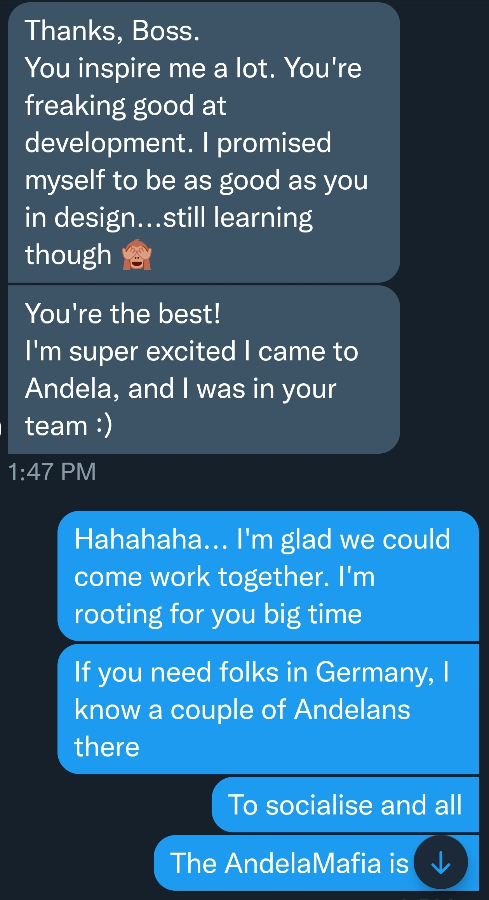
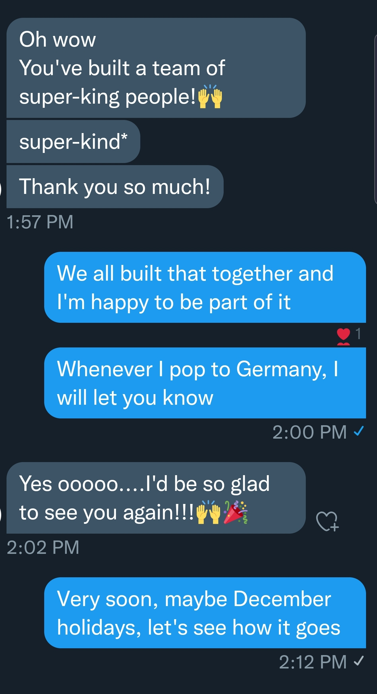
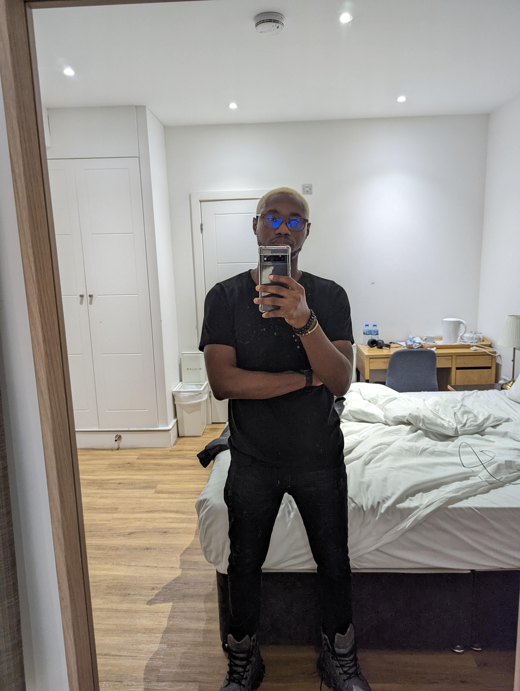

TL;DR
> 2021, the year that kept giving. A lot of things happened this year for sure; some wins and some lessons disguised as Ls (Loses). Summary about the summary; I left my full-time role, Moved cities, Signed up with a Professional Career Coach, Did Quality work, Put smiles on peoples faces, Made some new friends in Q4.

## How it Started

---
2020 ended with me having to battle for my sanity from life challenges. Looking back, one of the cause was me wanting to feel loved as it seemed I was missing out. This used to be hard to admit coming from someone who is supposedly content.

2021 started with me to the world <https://medium.com/@walecloud/hope-by-doing-7d6eb371d61a>
The next day, well I forced myself for a run after a set-back on my peace of mind.

## Work

---

### What went well

##### - Namely

Q1 was a busy period for me, worked my socks off at Namely to see the Report builder in the hands of our customers. This we achieved towards Q2 and I was proud of the work the team had done.

##### - Yutars

Talking about work and career, 2021 was both High and Low for my colleagues and I at <https://yutars.com>. We had over 7 Lenders using our platform at a time and running their FGN Negative investigation through us,
The triggered the birth of Blacklist to help with fraud prevention and reporting as we couldn’t get direct integration to these Lending companies due to according to them, “Licence”.

### What didn't go well

We tried getting funding but we were handed a handful of Nos. Did we stop? No. We continued and hired an Operator to further serve the lenders using our platform, this continued till the end of Q3 where the adoption dropped as the market demand changed to what we’ve been building but lacked the necessary toolkit (funding & licence).

We realised we could not meet payroll going forward and infrastructure bills kept pilling up so we did the honourable thing and let go of team members.

Sad to say we’re at a phase where we’re not sure how to proceed but as with everything since 2019, time makes things clearer.

## Resigning and Alternate Living

> I had a tough year working or my years of working began showing signs of burnout and an overdue rest was needed. I visited the hospital a bit too much in the last 3 years than I ever did in my Adult life.

---
`August 20 2021 I resigned from my role at the NY company Namely after almost 2 years. I had a great time there and loved the work we did but the end is part of our journey.`

I rested and enjoyed time with myself and my loved ones, planned for the next phase of my life, my heavy black tax and all. I thought I was going crazy but something in my head said it was the right decision.

Travelling and living like a nomad was one of those things I wanted to do,
>Oct 5th I took a step to moving to a new city 3 months in and I can say it is one of the best decision I made in 2021.

---

### What I have been upto

My biggest achievement would be me seeing my girls (sisters) growing in school and outside of school. About school, I played around and decided to do a graduate course in Artificial Intelligence, (somebody please save me 😅) well it has been sweet as I’ve being playing more football than studying. fortunately, my grades so far suggests otherwise with A's in the bag. Hoping to play more football and get more A's in my study 😅

Below screen shots is one of the highlights of the year was when former colleagues reached out to share their wins with me and how our paths together helped foster that;

## Appreciations

Thankful to quality friends, I love you guys.

My birthday was `Dec 7` I got some pretty interesting gifts to celebrate it.

## What Next 2022?

Getting the best of the year same way I go into every year while Living a Life of Impact. 🥂

Thank you for reading 😊, you can reach me on Twitter @walelcoud.

Featured Photo by <a href="https://unsplash.com/@enginakyurt?utm_source=unsplash&utm_medium=referral&utm_content=creditCopyText">engin akyurt</a> on <a href="https://unsplash.com/s/photos/2021-wrapped?utm_source=unsplash&utm_medium=referral&utm_content=creditCopyText">Unsplash</a>