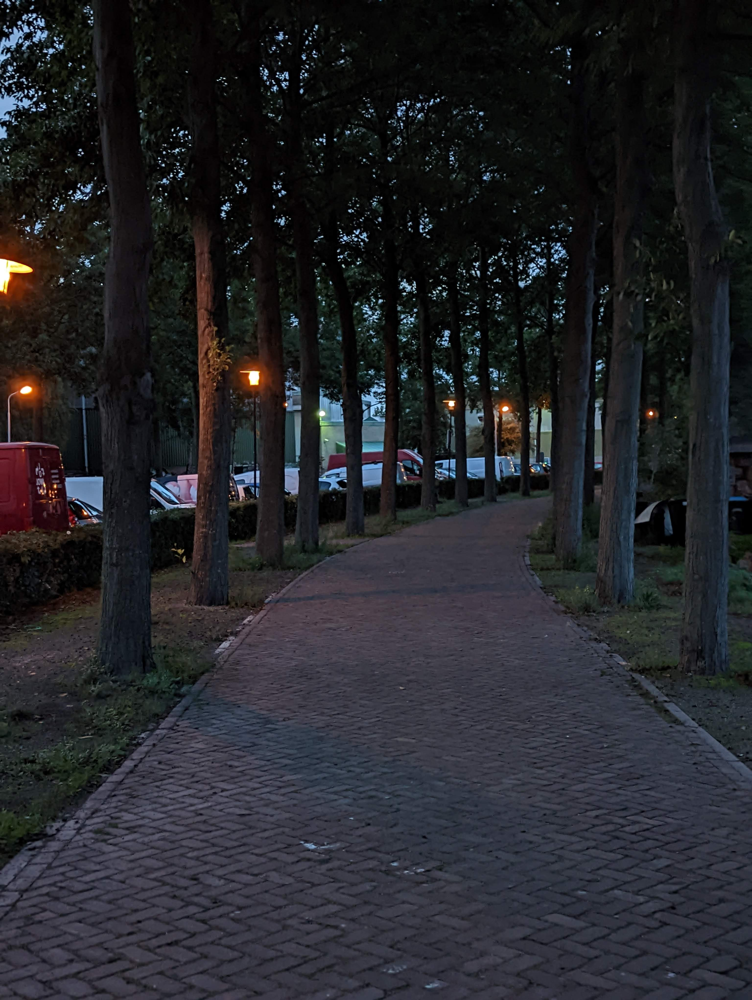

“You can give everything and people will turn around and say you ain't give enough.”

Certain experiences have more impact on how you want to interact with humans going forward. People usually term it as “lesson learnt”.

**But should this be a way to live?**

The slightly more elaborate answer is that you can't live your life on the back foot of what happens to you as a result of other people's actions.

This is close to something I find interesting about Adlerian psychology: the idea that what happened to you doesn't have to become the reason you don't become or do what you want. _We aren't simply pushed forward by causes from our past. There is also the direction we choose to move in._

Otherwise, that just sounds like a terrible way to live.

Everyone should develop and own their core values. Values that serve as a harness for how you want the world to experience you and, equally, how you want to experience the world.

Your response to certain situations will differ from event to event, of course. But those responses should still run within the harness of your values so you don't lose yourself while dealing with all the variants of human behaviour.

Someone takes advantage of your kindness, so you decide never to be that kind again.

Someone betrays your trust, so the next person now has to pay for what they did.

Someone doesn't appreciate what you gave, so next time you decide to give less.

I don't think that's a great way to live.

You should learn from experience, definitely.

But experience should improve your judgment, not completely rewrite who you are.

### Perspective is a funny thing

Someone asks you for financial support and you give them $50.

Another person has $1,000 and gives them $100.

From the receiver's perspective, even if they knew you only had $100 yourself, they could still see the second person as having given more.

After all, $100 is more than $50.

But you gave them a whopping 50% of everything you had.

The other person gave 10%.

There is nothing wrong with the second giver.

There is also nothing necessarily wrong with the receiver.

Life is about perspective.

People experience what you give them from where they are standing, not necessarily from where you are standing.

They may not fully understand what the $50 represented to you.

And even when they understand, they may still not appreciate it in the same way you expect them to.

Only people with a certain level of empathy or deeper conscience will sometimes look beyond the immediate gratification and ask what that thing actually cost the person who gave it.

That is why I don't think the lesson should always be:

“I'll never do that again.”

Maybe the better lesson is:

“I'll be more intentional about who I do that for.”

One changes your judgment.

The other changes your character.

### Being good-hearted is not enough

Being good-hearted doesn't cost much.

Do things for people without turning every interaction into a transaction.

But being good-hearted doesn't necessarily propel you at corporate work.

Unless everyone else is equally good-hearted, which sadly has never really been the case in human society, especially in group settings.

You can do a lot of invisible work.

You can prevent problems nobody will ever know were about to happen.

You can make other people better at what they do.

And still, somebody can turn around and ask:

“What exactly did you do?”

Not necessarily because they are bad people.

Sometimes, they simply didn't see it.

People see what is visible to them.

So be good-hearted, but also make sure you have evidence of your work, your output and your outcomes.

Know what changed because of it.

Know what you contributed.

Don't leave all of that to somebody else's memory or interpretation.

That isn't being transactional.

That is just being sensible.

### Don't let people decide who you become

There will always be people who misunderstand what you gave.

People who don't appreciate what it cost you.

People who take more than they return.

People who interpret kindness as weakness.

And there will also be people who completely understand it.

You can't control which one you meet.

What you can control is who you become after meeting them.

Pay attention to patterns.

Be less naive where you need to be.

But don't let every bad experience slowly turn you into somebody you don't recognise.

There is a difference between learning a lesson and becoming a product of other people's behaviour.

Experience should refine you.

In another write-up, I'll talk about human perspective, blind spots, their effects and how we can harness them better in our day-to-day lives.

For now, this is where I land:

**Learn from how people treat you, but don't let how people treat you decide the kind of person you become.**

_Living you with a Picture from 2022 on an evening walk in Zaandam Netherlands._

A picture I took on an evening walk in Zaandam, Netherlands in 2022.
