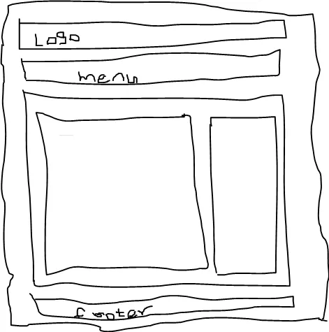
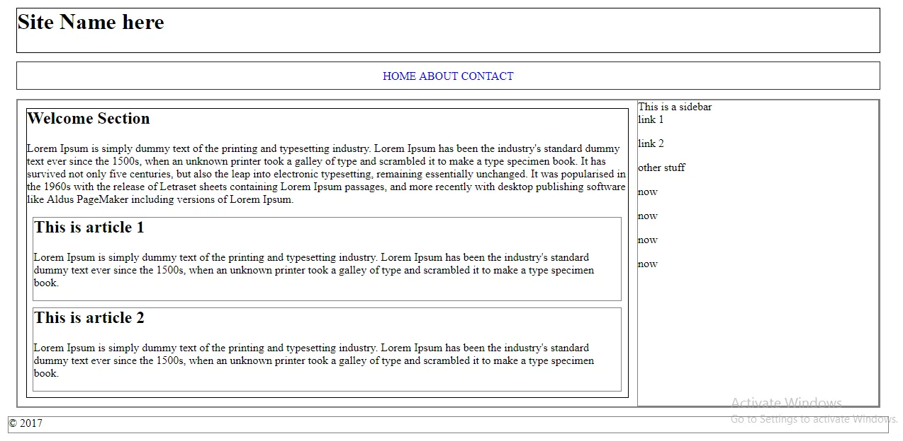
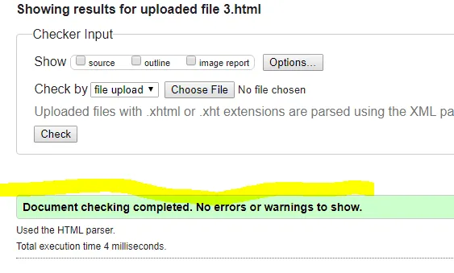
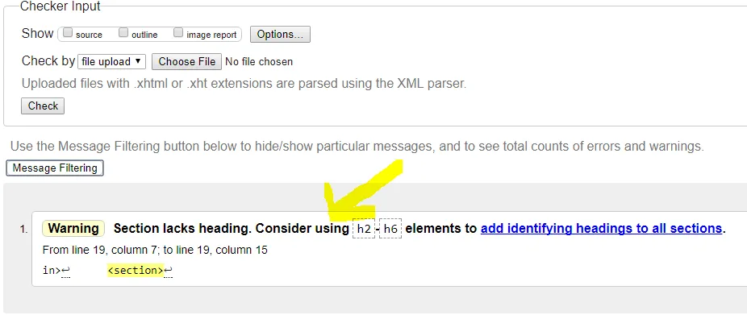

***First published on [justcodenow](https://medium.com/justcodenow/building-the-right-way-html5-semantics-7190bdb269c4)***

Hello there!

I hope you were able to get your feet wet with previous posts on web development front-end.

Building a website can be considered easy (I’m not saying it’s difficult) but often times, people forget building to standard and validation. Oh yes, I said VALIDATION. Because html has no syntax error checking, doesn’t mean it has no validation mechanism put in place.

W3CValidator, a service by the World Wide Web Consortium (W3C.org) to check for markup (HTML) validation of web documents.

In this post, we will be learning how to construct a webpage with Html5 semantics which includes the following:

```html
  <!doctype>
  <header></header>
  <nav></nav>
  <main></main>
  <section></section>
  <article></article>
  <aside></aside>
  <footer></footer>
```
You can already tell with their names what they represent.

The appropriate use of these semantics will make search engines like Google to better index your sites.

Now, let’s build a full page that makes use of the tags above.

The Page will consist of the following;

```
A logo
Menu Links
Right Sidebar
Main content area
Footer menu.
```
Note that these tags are not styled by default to be positioned as their name implies on a webpage. You still have to write a CSS for it to be well positioned.

Here’s a sketch of what we will be building. :)


Begin by writing the markup for the sketch above.

```html
<!DOCTYPE html>
<html>
<head>
   <meta charset="utf-8">  
   <title>HTML5 SEMANTICS</title>
</head>
<body>
  <header>
    
  </header>
  <nav>
    
  </nav>
  <main>
      <section>
        <h2></h2>
        <article>
          <h2></h2>
        </article>
        <article>
          <h2></h2>
        </article>
      </section>
      
      <aside>
        
      </aside>
  </main>
  <footer>
    
  </footer>
</body>
</html>
```
You must have noticed that I added some tags (<h2></h2>) to the markup which I did not mention. This is because to make valid use of the tags (article,section) a heading tag must follow it.

It’s time to have our markup styled, before that, how about we get some random texts to fill up our page. Do this quickly.

```html
<!DOCTYPE html>
<html>
<head>
  <meta charset="utf-8">
  <title>HTML5 SEMANTICS</title>
  <link rel="stylesheet" type="text/css" href="style.css">
</head>
<body>
  <header>
    <h1>Site Name here</h1>
    <!-- logo here -->
  </header>
  <nav>
    <a href="#">Home</a>
    <a href="#">About</a>
    <a href="#">Contact</a>
  </nav>
  <main>
      <section>
        <h2>Welcome Section</h2>
        <p>Lorem Ipsum is simply dummy text of the printing and typesetting industry. Lorem Ipsum has been the industry's standard dummy text ever since the 1500s, when an unknown printer took a galley of type and scrambled it to make a type specimen book. It has survived not only five centuries, but also the leap into electronic typesetting, remaining essentially unchanged. It was popularised in the 1960s with the release of Letraset sheets containing Lorem Ipsum passages, and more recently with desktop publishing software like Aldus PageMaker including versions of Lorem Ipsum.</p>
        <article>
        <h2>This is article 1</h2>
        <p>Lorem Ipsum is simply dummy text of the printing and typesetting industry. Lorem Ipsum has been the industry's standard dummy text ever since the 1500s, when an unknown printer took a galley of type and scrambled it to make a type specimen book.</p>
      </article>
      <article>
        <h2>This is article 2</h2>
        <p>Lorem Ipsum is simply dummy text of the printing and typesetting industry. Lorem Ipsum has been the industry's standard dummy text ever since the 1500s, when an unknown printer took a galley of type and scrambled it to make a type specimen book.</p>
      </article></section>
      
      <aside>
        This is a sidebar
        <p>link 1</p>
        <p>link 2</p>
        <p>other stuff</p>
        <p>now</p>
        <p>now</p>
        <p>now</p><p>now</p></aside>
  </main>
  <footer>
    &COPY; 2017
  </footer>
</body>
</html>
```
Create a new file, name it style.css

Add the following codes to it…
```css
html, body {
 margin: 2%;
 padding: 0;
 font-family: roboto;
 font-size: 20px;
}* {
 box-sizing: border-box;
 margin-top: 0px;
}header {
 height: 80px;
 border: 1px solid black;
 margin: 1%;
}nav {
 height: 50px;
 border: 1px groove grey;
 text-align: center;
 text-transform: uppercase;
 margin: 1%;
}nav a {
 text-decoration: none;
 line-height: 2.5;
}main {
 display: flex;
 border: 2px solid grey;
 margin: 1%;
}section {
 flex: 5;
 border: 1px solid black;
 margin: 1%;
}article {
 flex: 5;
 border: 1px solid grey;
 margin: 1%;
 
}aside {
 flex: 2;
 border: 1px solid grey;
 float: right;
 display: block;
 width: 30%;
 
}footer {
 height: 30px;
 margin-bottom: 50px;
 border: 1px solid grey;
}
```
Link the css to the html file.

Notice that we didn’t create any class property in our css, it’s a preference thing for me. Otherwise, you can create a class property in your css.

Our output as expected

Next we test our webpage to see if it’s valid according to the W3C rule.

Go to validator.w3.org

Since our file is not hosted online,select the option to upload a file, select your file.html and click check.

Check your results, you should have no errors nor warnings.
 File validity checked no errors.

As you can see the result shows a valid html file. Now let’s break things intentionally and see if we will get an error or warnings.

<remove some tags,place tag anyhow>

Save and upload again to validate.
 Invalid file Warnings.
As you can now see, we have errors saying that our file has issues. Fix them and upload again.

Benefits of properly marking up you html and checking for validation.

- Accessibility
- As a future proof quality check
- Ease of maintenance
- Shows professionalism

More can be find at https://validator.w3.org/docs/why.html

We have technically built a web template that we can work on to build a full web site.

Next we will be looking at building a minimalist website template with html5 and css3.

I hope you’ve learnt something!

Thank you for your time. :)
