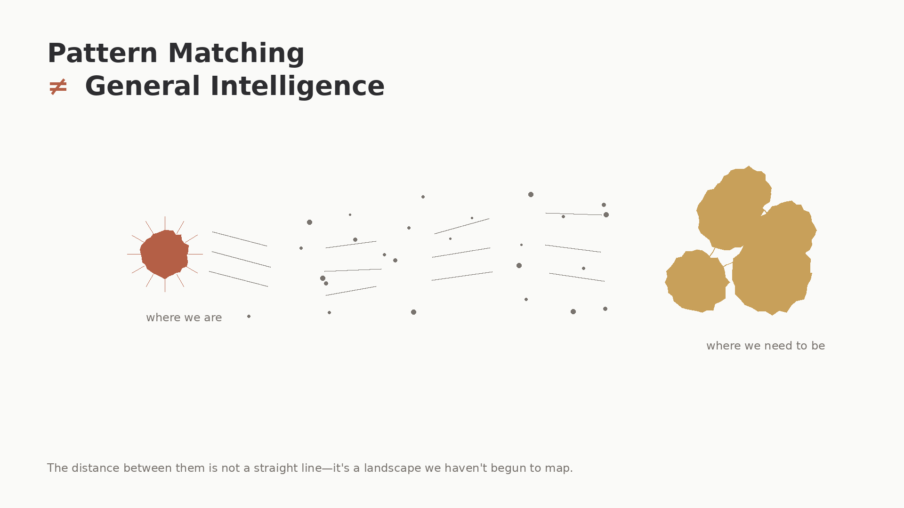

Despite claims from Big AI Tech execs, we're nowhere near Artificial General Intelligence. Current LLMs excel at pattern matching but lack the core traits that defines General Intelligence. True AGI requires more than benchmark scores - it demands cross-domain environmental success, robust adaptation to novelty, and self-directed learning. While we're beginning to see early steps toward agentic systems through MCPs tool calling, these are brute-force approximations for a semblance of agency. The path to AGI will require AI systems that operate with high agency across unfamiliar domains with minimal supervision, a capability that remains fundamentally out of reach for today's LLMs.

Big AI Tech Execs will have you believing that we're close to AGI due to massive success and impact of LLMs in the past ~3 years. well I do not agree with this as you will too after this write up.

We have to really understand what it means to be Generally Intelligent for humans and what qualifies to assume an entity is generally intelligent, what traits constitutes having General Intelligence.

## What is General Intelligence?

There's no established textbook definition for General Intelligence, however; it has core traits that matter

- **Generality::** solves many different kinds of problems, not just one task or domain.
- **Transfer Learning::** applies knowledge from one domain to another without full retraining.
- **Sample Efficiency::** learns from few examples or weak supervision.
- **Adaptability::** handles novel situations and unexpected changes.
- **Reasoning and Planning::** chains multi-step logical steps and forms plans over time.
- **Grounding and Commonsense::** links symbols to real world meaning and causal relations.
- **Continual Learning::** gains new skills without catastrophic forgetting.
- **Autonomy and Goal pursuit::** sets and pursues sub-goals with minimal human direction.
- **Meta-cognition and Self-improvement::** monitors its own performance and refines strategies.
- **Robustness and Safety::** behaves reliably under distribution shifts and respects constraints.

From these traits, we can define General Intelligence as the the ability to solve a wide variety of generic problems under unfamiliar environments with autonomy of action and consequences, to learn efficiently from limited experience and transfer such skills between domains. it implies more than pattern matching. it implies causal understanding, planning, persistent memory, and the capacity to pursue goals with little supervision.

### Traits of General Intelligence

Bring that understanding into AI, we can evaluate AGI as the ability for any AI system to meet the traits above.

Current LLM hype is premature to suggest that we're close to AGI until we can evaluate them on the following i'd argue;

- Cross-domain performance on practical tasks.
- Few-shot or zero-shot learning on genuinely new problems.
- Real-world environment task success, not benchmark scores.
- Robustness to adversarial impacts.
- Ability to acquire and use long-term memory.
- Evidence of self-directed learning or algorithmic improvement.

"General Intelligence can be akin to a human with **High Agency**"

### An Example of LLM failure on the path to AGI

Real-time Game Learning - Put an LLM in control of a simple but novel video game it's never seen in its training data, for eaxmple a custom puzzle game with unique mechanics. A human player figures out the rules through trial and error in minutes. The LLM either fails completely or requires thousands of examples to learn what a human grasps in 10 attempts.

**It can't build a mental model on the fly, test hypotheses, and adapt. This is the transfer learning and sample efficiency gap in action.**

### View on Progression Path

One Major key that unlocks the rest will be cross-domain environment successes.

We shall begin to see AI doing more cross-domain activity, though it would be brute-force and ad-hoc at first - at best. This however is a necessary step for the evolution on Artificial Intelligence.

We will also begin to see what i will call Agency Operators on the application layer, AI operators that will not just respond, act but have total agency of action and initiatives across surface areas they've been exposed to at some point with minimal ongoing human direction.

The first iteration of this we've seen with MCPs, function and tool callings, the next iteration will be agency for the agents with less and less human inputs.

What comes next is what I term AWO - Autonomous Worker Operators. What is AWO? I will more on this in the next article.
